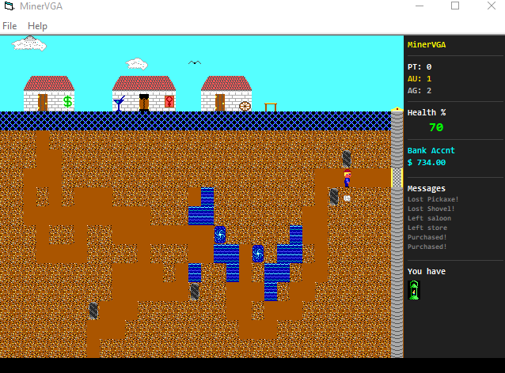

# MinerVGA - Visual Basic 6 Clone

A faithful recreation of the classic MinerVGA mining game, built in Visual Basic 6.



## About

MinerVGA is a mining simulation game where you dig through the earth searching for precious minerals (silver, gold, and platinum) while avoiding hazards like cave-ins, whirlpools, and underground springs. Your goal is to accumulate $20,000 and find a diamond ring to win Miss Mimi's hand in marriage!

## Features

- **Classic Mining Gameplay** - Dig through dirt, discover minerals, and avoid hazards
- **Multiple Hazards** - Cave-ins, whirlpools, underground springs, granite, water floods
- **Town Buildings** - Visit the Hospital, Bank, Store, Saloon, and Outhouse
- **Dynamic Market** - Mineral prices fluctuate every 30 seconds at the bank
- **Inventory System** - 12 different items including shovel, pickaxe, drill, dynamite, lantern, and more
- **Elevator System** - Upgrade your elevator to reach deeper, richer deposits
- **High Score System** - Track your best runs with persistent high scores
- **Save/Load System** - Save your progress and continue later
- **Sound Effects** - Audio feedback using Windows Beep API

## How to Play

### Controls

| Key | Action |
|-----|--------|
| Arrow Keys | Move / Dig |
| E | Enter building (when at door) |
| T | Elevator to top |
| B | Elevator to bottom |
| D | Use drill on granite |
| P | Pump water |
| Y | Use dynamite |
| Q | Toggle sound |
| H | Show help |
| S | Quick save |
| R | Quick load |
| X | Exit game |

### Buildings

- **Hospital** - Heal injuries for a fee
- **Bank** - Sell minerals for cash, sell diamonds
- **Store** - Purchase equipment and upgrades
- **Saloon** - Rest, eat, drink, and visit Miss Mimi
- **Outhouse** - A mysterious place...

### Items

| Item | Cost | Description |
|------|------|-------------|
| Shovel | $50 | Reduces digging cost |
| Pickaxe | $100 | Further reduces digging cost |
| Drill | $500 | Drills through granite (20 uses) |
| Lantern | $75 | See hidden minerals (long lasting) |
| Torch | $25 | See hidden minerals (short lasting) |
| Bucket | $30 | Pump water (20 uses) |
| Dynamite | $200 | Clear cave-ins and obstacles |
| Diamond Ring | $5,000 | Required to win the game |
| Condom | $5 | Reduces movement cost |

### Win Condition

Accumulate **$20,000** in cash AND acquire a **Diamond Ring**, then visit Miss Mimi at the Saloon!

## Building from Source

### Requirements

- Visual Basic 6.0 (SP6 recommended)
- Windows Common Dialog Control (comdlg32.ocx)

### Steps

1. Clone the repository
2. Open `MinerVGA.vbp` in Visual Basic 6
3. Press F5 to run or Ctrl+F5 to compile

### Project Structure

```
MinerVGA/
├── frmMain.frm          # Main game form with rendering
├── frmBank.frm          # Bank building interface
├── frmStore.frm         # Store building interface
├── frmHospital.frm      # Hospital building interface
├── frmSaloon.frm        # Saloon building interface
├── frmOuthouse.frm      # Outhouse building interface
├── frmHelp.frm          # Help screen
├── frmHighScores.frm    # High scores display
├── modGameData.bas      # Game constants and data types
├── modPlayer.bas        # Player movement and actions
├── modGrid.bas          # Grid generation and management
├── modInventory.bas     # Inventory and save/load system
├── modHighScores.bas    # High score management
├── modSound.bas         # Sound effects (Windows Beep API)
├── tileset.bmp          # Sprite tileset (16x24 tiles)
├── title-screen.bmp     # Title screen graphic
└── MinerVGA.vbp         # VB6 project file
```


## Technical Details

- **Grid Size**: 40 columns x 118 rows
- **Tile Size**: 16x24 pixels
- **Viewport**: 32x17 visible tiles
- **Rendering**: Uses `PaintPicture` and `TransparentBlt` API for sprites

### Mineral Spawn Rates (per 1040 tiles)

| Mineral | Chance |
|---------|--------|
| Platinum | 25 |
| Gold | 75 |
| Silver | 125 |

### Hazard Spawn Rates

| Hazard | Chance |
|--------|--------|
| Spring | 240 |
| Cave-in | 300 |
| Granite | 250 |
| Whirlpool | Rare |

## Credits

- Original MinerVGA game concept
- VB6 clone implementation
- Sprite artwork based on classic MinerVGA assets

## License

MIT License = this project is a fan-made clone.

---

*Dig deep, strike it rich, and win Miss Mimi's heart!*
